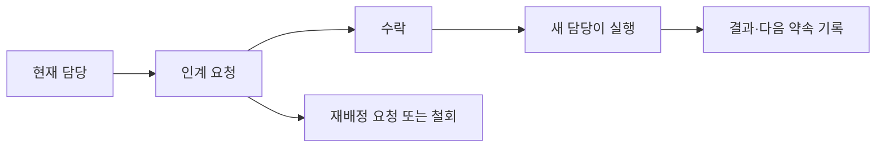

# 이음앱 목양 협업 개선 설계안 v1.0

작성일: 2026-09-12

담당: Media & Tech Owner / UI·UX 설계. 사역 기준은 Formation & Care 자료를 대조했다.

검토 기준: 로컬 `27e27e8` 및 기존 미커밋 작업. 역할별 실제 계정과 현장 사용성은 추가 검증 대상이다.

산출물 성격: 구현 기준과 단계별 완료 조건을 기록한 설계서. 2026-09-12에 첫 수직 기능과 운영 DB 기반을 반영했다.

## 1. 제안하는 제품 방향

**리더가 한 성도의 상황을 이해하고, 자신이 맡은 돌봄을 기록하고, 다른 리더에게 이어줄 수 있는 공동 목양 공간을 만든다.**

사용자가 로그인한 뒤 답을 얻어야 하는 질문은 세 가지다.

1. 이번 주 내가 챙길 사람은 누구인가?
2. 이 사람에게 누가 어떤 연락을 했고, 다음에는 무엇을 하기로 했는가?
3. 인계 요청을 상대 리더가 실제로 맡았는가?

개인총괄은 관리자 보조 메뉴로 이동하고 확장을 보류한다. 개인총괄의 사적 기록은 공용 돌봄 기록으로 자동 전환하지 않는다. 기존 출석·순·새가족·양육·예배·공동 일정은 유지하면서 사람 ID와 후속 조치로 연결한다.

### 첫 출시 범위

- 담당 범위와 기록 공개 범위.
- 이번 주 목양 홈과 성도 통합 상세.
- 짧은 연락 기록, 다음 약속, 담당자 인계 및 수락.
- 내 순 출석과 성도 상세 연결, 저장 상태 개선.
- 연결 확인 근거, 순 배정 원본의 일치.

자동 연락 발송, 채팅방, AI 상담 요약, 개인 생산성 도구 확대, 전면적인 예배기획 개편은 후속 과제로 둔다. 첫 출시는 수동 돌봄 생성과 인계로 협업을 검증하고, 자동 확인 목록은 데이터 정리가 끝난 뒤 추가한다.

## 2. 현재 구현과 바꿀 부분

| 영역 | 확인한 현재 상태 | 제안 |
|---|---|---|
| 홈 | 공지·통합 캘린더·자료·마감 뒤에 내 순과 통계 | 목양 조치를 앞에 배치. 일정은 요약과 기존 전체 보기 유지 |
| 메뉴 | 총괄·목양·예배별 기능 나열, 개인총괄은 관리자 전용 | 주요 업무를 홈·담당 공동체·성도·사역으로 묶기 |
| 성도 상세 | 기본 정보·순/팀·새가족 단계·휴적·상태 이력 | 최근 연락·다음 행동·담당자·출석·양육을 한 사람 기준으로 통합 |
| 인계 | 새가족 담당자 변경 가능 | 요청·수락·재배정·완료 근거를 별도 기록 |
| 권한 | 관리자·다락방장·순장·승인 대기 | 기존 계정 역할과 별도로 사역 책임·대상 범위 부여 |
| 출석 | 순별 권한 검사, 미입력 구분, 기도 메모, 하단 고정 저장 | 안부 요청 연결, 저장 변경분/충돌 처리, 미입력 보정 |
| 새가족 | 교육 단계와 수동 연결 완료 존재 | 방문자 단계 분리, 실제 연결 근거, 교육과 연결 상태 분리 |
| 순 신청 | 신청 배정이 실제 순원 배정과 다른 저장 경로 | 참여 확정 시 동일 원본 반영, 성도 식별 미완료는 대기 표시 |
| 1:1 양육 | 관계·진행 상태·회차 기록 | 맡은 양육자가 직접 기록, 다음 만남 연결 |

기존 검토 문서의 문제를 현재 기능으로 그대로 간주하지 않는다. 현재 새가족 페이지에는 과거 자동 이탈 호출이 없고, 수동 연결 완료 기능도 있다. 이번 설계는 이 기능을 보강하는 것이다.

## 3. 메뉴와 이동 구조

### 데스크톱

| 주 메뉴 | 하위 화면 | 기본 진입 |
|---|---|---|
| 이번 주 목양 | 내가 맡은 일 / 인계 요청 / 팀 점검 | 역할과 담당 범위에 맞는 조치 |
| 담당 공동체 | 내 순 / 담당 다락방 / 출석 | 현재 시즌의 자기 순 또는 다락방 |
| 성도 | 성도 검색 / 방문·새가족 / 연결 확인 | 담당 성도 우선, 허용 범위 검색 |
| 양육 | 내 양육 관계 / 진행 현황 | 맡은 양육 대상 |
| 공동 사역 | 일정 / 주간 자료 / 행사 / 예배팀·기획 | 공동 일정 |
| 운영 관리 | 순 편성 / 시즌 / 계정·권한 / 개인총괄 | 권한별 관리 도구 |

모바일은 하단에 **홈 / 담당 공동체 / 성도 / 더보기** 네 항목을 둔다. 담당 공동체 표시명은 순장에게 ‘내 순’, 다락방장에게 ‘내 다락방’으로 바뀐다. 순이 없는 웰컴 담당에게는 ‘내 담당’으로 배정 목록을 제공한다. 양육·공동 사역·운영 관리는 더보기에 둔다. 신규 보조 메뉴를 상단에 계속 추가하지 않는다.

기존 URL은 유지한다. `/members/[id]`를 통합 상세로 확장하고, 기존 `/attendance?group=…&date=…`와 `/new-family` 등의 링크는 계속 유효하게 한다. 새 홈 아래 공동 일정 전체 보기는 `/calendar`로 분리하되 기존 루트의 `date/view` 링크도 해당 화면으로 안내한다. 이때 SharedDashboard의 기간 이동 링크도 함께 갱신한다.

검색·기간·선택 순·목록 필터는 URL에 담는다. 상세에서 돌아오면 이전 필터와 스크롤 위치를 복원한다. 검색은 권한이 허용하는 사람과 필드에서만 수행한다.

## 4. 화면별 상세 설계

### A. 이번 주 목양

상단: 현재 시즌, 이번 주 기간(뉴욕 기준), 로그인한 사역 역할과 범위.

1. **내가 맡은 일:** 기한 지난 일 → 오늘 → 이번 주 순서. 카드에 이름, 필요한 이유, 다음 행동, 담당자, 기한, 최근 연락을 표시한다. 과거 날짜라는 이유로 사람 자체를 위험 상태로 표시하지 않는다.
2. **인계 요청:** 보내는 리더, 대상, 요청 내용, 희망 기한, 수락/재배정 요청. 상대가 수락하지 않은 것은 완료로 표시하지 않는다.
3. **팀 점검:** 목양 총괄과 해당 범위 다락방장에게 미배정·인계 대기·확인 기한 경과 건을 보여준다. 순장에게 불필요한 전체 교회 숫자를 보여주지 않는다.
4. **공동 일정:** 가까운 일정 최대 3개, 주간 자료 링크와 전체 보기. 공지는 중요도/유효기간에 따라 요약한다.

카드 대표 행동은 ‘기록하기’ 또는 ‘인계 확인’ 하나다. 이름을 누르면 성도 상세가 열린다. 다수 조치는 사람별로 묶어 같은 사람에게 이미 연락 예정인 리더를 확인할 수 있게 한다.

빈 상태는 ‘이번 주 예정된 돌봄이 없습니다’와 ‘필요한 돌봄 추가’를 표시한다. 조회 실패는 ‘돌봄 목록을 불러오지 못했습니다’와 재시도를 보여준다. 둘을 동일한 0건으로 표시하지 않는다. 담당 연결이 없는 계정은 ‘담당 배정 확인 중’과 관리자에게 요청할 경로를 제공한다.

### B. 성도 통합 상세

첫 영역: 이름, 소속 단계, 실제 연결 상황, 주 담당 리더, 마지막 확인일, 가장 가까운 다음 약속.

| 탭 | 내용 |
|---|---|
| 요약 | 현재 소속·연결 상황, 열린 돌봄, 다음 약속, 최근 참여 |
| 돌봄 이력 | 날짜순 연락·만남·인계·다음 약속. 작성자와 공개 범위 표시 |
| 출석·양육 | 최근 8주 출석/결석/미입력, 양육 관계·회차·다음 만남 |
| 기본 정보 | 업무에 필요한 연락처·학교/직장·순/팀·휴적 이력 |

주 행동: ‘연락 기록’, ‘다음 약속’, ‘인계 요청’. 기본정보 편집과 휴적/이동 변경은 보조 메뉴에 두며 권한에 따라 제공한다. 전화 연결은 연락처 열람 권한이 있는 사용자에게만 노출한다.

순 배정, 교육 진도, 출석 사실은 원래 기록을 조회한다. 통합 상세에서 별도의 사본을 수정하지 않는다. 비공개 기록은 권한 없는 사람에게 제목·작성자·개수·존재 알림까지 노출하지 않는다.

### C. 연락 기록과 다음 약속

모바일에서는 한 화면 폼, 데스크톱에서는 상세 옆 입력 영역으로 제공한다. 긴 상담일지 작성을 요구하지 않는다.

| 필드 | 입력 방법·규칙 |
|---|---|
| 성도 | 진입한 성도로 자동 채움 |
| 연락일·방법 | 오늘 기본값, 전화/메시지/대면/기타 |
| 결과 | 연결됨 / 응답 대기 / 일정 조율 / 연락 원치 않음 |
| 짧은 메모 | 선택 입력. 사실과 다음 행동 중심, 상담 전문 입력을 유도하지 않음 |
| 다음 행동 | 연락/식사 초대/교육 안내/관계 연결/담당자 공유/없음 |
| 담당·기한 | 다음 행동이 있으면 필수. 본인 기본값, 실제 책임 부여는 수락 규칙 적용 |
| 공개 범위 | 대상 범위와 실제 열람자 확인. 민감한 공유는 지정 목양담당/목회자로 제한 |

‘응답 대기’는 해결 완료로 처리하지 않는다. 연락 시도는 이력으로 저장하고 해당 돌봄에는 다음 확인일을 둔다. ‘다음 행동 없음’은 해당 연락이 끝났음을 의미할 뿐, 다른 열린 돌봄을 닫지 않는다. 돌봄을 종료할 때는 해결/요청 철회/중복 등 이유가 필요하다.

‘연락 원치 않음’은 연락 제한으로 명확히 저장하고, 자동 감사 연락·후속 연락 후보에서 제외한다. 재연락은 의사 변경 확인 근거가 있어야 한다. ‘본인 응답 대기’와 ‘앱 담당자 수락 대기’를 구분한다.

저장 전 공개 대상 이름을 확인할 수 있다. 저장 중 버튼 중복 실행을 막고, 성공은 서버 저장을 확인한 뒤 표시한다. 실패하면 입력을 유지하고 재시도를 제공한다. 저장하지 않고 이탈할 때 알린다.

### D. 내 순 / 담당 다락방

순장: 순원 명단, 이번 주 출석, 다음 만남, 배정받은 돌봄. 다락방장: 담당 순별 출석 입력 현황과 지원 요청, 순별 상세로 이동.

출석은 ‘출석 / 결석 / 미입력’을 구분한다. 미입력은 결석으로 집계하지 않는다. 변경한 사람의 기록만 저장하고, 이미 저장한 출석을 다시 미입력으로 바꿀 때도 명시적인 수정이 전달되어야 한다. 기존 upsert에서 빠지는 행을 삭제로 추정하지 않는다.

기도 기록은 출석 체크 여부와 무관하게 저장할 수 있는 돌봄 기록으로 분리한다. ‘기도 요청’과 ‘담당자 확인 요청’을 구분하고, 공개 범위는 저장 전에 보여준다. 같은 성도의 진행 중인 안부 확인이 있으면 이를 열어 추가 기록하도록 제안한다.

### E. 방문·새가족·연결

목록은 ‘첫 방문 / 교육 진행 / 연결 확인’으로 나누고 담당자·최근 접점·다음 행동을 같은 카드 문법으로 표시한다. 거대한 단계 보드를 모바일에서 가로로 스크롤하게 만들지 않는다.

방문자 카드 접수는 방문 사실이다. 공동체 소속 의사나 교육 참여 의사 확인 후 새가족 과정으로 전환한다. 기존 사람 ID는 유지하고 반복 제출은 후보 중복으로 보여 담당자가 식별한다. 이름만으로 자동 병합하지 않는다.

연결 완료의 제안 기준은 **주 담당자 + 본인 소속 의사 확인 + 순·관계자·팀 중 최소 하나의 실제 접점 + 목양 담당자의 최종 확인**이다. 배정과 실제 만남을 구분한다. 확인일·확인자·연결 대상·짧은 근거를 남긴다.

기존 매뉴얼은 연결 대상 중 최소 하나를 허용하고 운영 시스템 문서는 담당자와 실제 연결을 더 구체적으로 요구한다. 위 기준은 두 문서를 조정한 설계 권고이며 이미 확정된 새로운 사역 규칙으로 간주하지 않는다. 성도로 인정하는 시점과 관계 연결 완료는 별개로 유지한다.

## 5. 인계와 책임 규칙

- ‘협조 요청’과 ‘담당 인계’를 구분한다. 협조 요청은 주 담당자를 변경하지 않는다.
- 인계 요청 시 대상, 목적, 다음 행동, 기한, 전달 가능한 기록을 지정한다.
- 수락 전 책임은 기존 담당에게 남는다. 새 방문자처럼 기존 담당이 없으면 팀 조정 담당이 책임진다.
- 받는 리더는 요청에 필요한 최소 신원·공개 가능한 요약을 보고 수락 또는 재배정을 요청한다. 기존 비공개 기록 전체는 열리지 않는다.
- 수락은 담당 관계 변경과 인계 이력 저장을 한 번에 처리한다. 두 명이 동시에 수락하면 한 명만 성공하고 다른 사람에게 최신 담당을 보여준다.
- 거절·철회·장기 대기는 미해결 상태로 조정 담당에게 남는다. 기존 담당 탈퇴/역할 해제 시에도 미배정으로 숨겨지지 않도록 조정 담당 목록에 올린다.
- 일반 요청 수락 점검은 2일을 제안 기본값으로 둔다. 내부 매뉴얼에 없는 새 제안이며 팀별 조정 가능하다.
- 시즌 변경이 열린 돌봄을 종료하거나 새 순장에게 민감 기록을 일괄 공개하지 않는다. 담당 검토·인계를 별도로 수행한다.

## 6. 역할·범위·공개 정책

권한은 ‘할 수 있는 일 × 맡은 사람/공동체 × 기록 공개 대상’의 교집합으로 결정한다. 순장·다락방장 직책과 웰컴·양육 등 사역 책임은 겸임할 수 있다. 화면 역할 전환은 실제 부여된 권한만 선택하며 권한을 새로 만들지 않는다.

| 책임 | 읽는 범위 | 실행 가능한 작업 | 제한 |
|---|---|---|---|
| 목양 조정 담당 | 지정 목양 운영 범위의 사람·일반 돌봄 | 배정·인계 조율·연결 확인 | 목회자 전용 기록은 별도 지정 필요 |
| 다락방장 | 담당 다락방과 직접 배정된 대상 | 일반 돌봄·순장 지원·인계 요청 | 다른 다락방과 제한 기록 자동 열람 불가 |
| 순장 | 현재 자기 순과 직접 배정된 대상 | 출석·연락·다음 약속·지원 요청 | 성도 소속 종료·타 순 기록 일괄 편집 불가 |
| 웰컴·새가족·연결·돌봄 담당 | 맡은 접수/과정/돌봄 대상 | 담당 과정 기록·후속 조치·인계 | 직책 때문에 전체 명단을 공개하지 않음 |
| 양육자 | 맡은 양육 관계 | 회차·만남·다음 일정 | 다른 양육 관계와 상담 내용 열람 불가 |
| People & Teams | 허용된 현원·배치 정보 | 순/팀 편성·확정된 소속 변경 반영 | 민감한 돌봄 본문 자동 열람 불가 |
| 목회자 | 지정된 목양 범위·제한 기록 | 민감 케이스·이동/종료 판단 | 권한 지정 이력 필요 |
| 기술 관리자 | 계정·권한 설정 | 승인·설정·접근 문제 조치 | 앱 계정 관리자 권한만으로 민감 본문 열람 불가 |

공개 수준은 ‘담당 리더 공유 / 지정 목양담당 / 지정 목회자’로 단순화한다. 첫 수준도 전체 리더 공개가 아니라 현재 담당 관계로 허용된 사람이다. 제한 수준은 지정 수신자와 작성자 중 유효한 접근 자격을 가진 사람에게만 허용한다. 이름과 직책으로 실제 수신자를 확인한다. 기술적인 서버 운영 권한 보유자가 DB에 접근할 가능성과 앱 화면의 업무 권한은 별개다.

현재 SQL에는 넓은 조회 정책이 있으므로 운영에 적용된 정책 목록을 확인하고 새 제한 정책과 충돌하는 허용 정책을 정리해야 한다. 메뉴 숨김만으로 구현하지 않는다. 서버 조회·쓰기·DB 접근 정책 모두 검사하며 검색, 통계, 내보내기, 알림에도 동일한 범위를 적용한다.

초대 → 가입 → 승인 → 기존 성도 정보 연결 → 사역 책임/범위 지정 → ‘내가 볼 수 있는 대상’ 확인의 순서로 시작한다. 역할 해제 시 접근은 즉시 회수하고 열린 돌봄을 조정 담당에게 넘긴다.

## 7. 상태와 자동 확인 목록

### 상태 원본

- 소속 단계: 방문자 / 새가족 / 성도 / 이동·종료 / 확인 전.
- 연결 상태: 확인 전 / 연결 필요 / 진행 중 / 확인 완료 / 재연결 필요.
- 참여 사정: 휴적·사전 공유된 부재·복귀 예정 등 별도 기간 기록.
- 돌봄: 미배정 / 진행 / 응답 대기 / 일시 보류 / 종료. 사람에게 ‘정상/문제’ 딱지를 붙이지 않는다.

교육 진도, 출석, 소속, 관계 연결을 한 상태값으로 덮어쓰지 않는다. UI의 ‘확인 필요’는 열린 돌봄과 확인 근거에서 계산해 중복 상태 원본을 줄인다.

### 자동화는 판단 후보와 기한을 만든다

| 계기 | 기준 근거 | 생성할 다음 행동 |
|---|---|---|
| 첫 방문 | 내부 기준: 1주 이내 감사 연락 | 접수 시 첫 연락 조치, 방문일+7일 기한. 기한 후 미완료 강조 |
| 교육 진도 정체 | 내부 기준: 14일 변화 없음 | 교육 일정 확인 후보. 이탈·제적으로 바꾸지 않음 |
| 교육 완료 후 미연결 | 내부 기준: 28일 | 연결 상황 확인 후보 |
| 사전 공유 없는 4주 미출석 | 내부 기준: 4주 | 출석 기록과 부재 사정을 검토한 안부 확인 후보 |
| 8주/12주 지속 | 내부 기준 | 담당 리더 보고 / 상태 재검토 후보. 자동 소속 종료 금지 |
| 열린 돌봄에 다음 행동 없음 | 운영 설계 기준 | 조정 담당에게 다음 행동 지정 요청 |

출석 원본이 비어 있으면 먼저 ‘출석 기록 확인’으로 분리한다. 자동 안부 후보는 지난 4회의 해당 예배가 실제 열렸고 모두 결석으로 기록되었으며 휴적·사전 공유·연락 제한이 없을 때 생성한다. 기록 부족으로 후보가 안 만들어진 사람은 별도 기록 확인 목록에 남기므로 누락을 가리지 않는다. 방학·예배 취소·시즌 전환은 회차 계산에서 처리한다.

동일 대상·유형·진행 구간의 미종료 조치는 한 건만 유지한다. 보류 시 이유와 다시 확인할 날짜를 필수로 두어 매일 같은 항목을 재생성하지 않는다. 외부 메시지는 자동 발송하지 않는다.

## 8. 데이터·저장 설계

기존 `members.id`를 모든 사람 기록의 기준으로 유지한다. 아래 이름은 구현 시 확정할 제안이다.

| 원본 | 저장할 책임 |
|---|---|
| 기존 members·순·attendance·new_family·one_to_one | 사람 식별, 실제 배정, 출석 사실, 교육·양육 원본 유지 |
| care_assignments | 대상자·담당 계정·사역 책임·주 담당 여부·유효기간 |
| care_cases | 대상·필요 이유·진행 상태·담당·기한·다음 확인일·종료 이유 |
| care_logs | 대상·연관 돌봄·연락일·작성자·방법·결과·메모·공개 범위·수정 이력 |
| care_handoffs | 인계/협조 구분·요청자·수신자·상태·요청/응답일·버전 |
| member_care_profile | 소속 의사 확인, 연결 근거·확인자·확인일·연락 제한 |
| ministry_grants / record_access | 사역 권한·대상 범위·제한 기록 수신자 |
| intake_submissions | 방문·신청 원본과 사람 식별 결과, 중복 검토 상태 |

화면의 ‘다음 행동’은 열린 care_cases의 대표 조치로 계산한다. 한 성도에게 여러 독립 조치는 가능하되 대표 행동을 요약해 보여준다. 주 담당은 활성 관계에서 한 명만 허용한다. 로그인 계정과 성도 ID를 혼용하지 않고, 비계정 관계 연결자를 책임 있는 앱 담당자로 오인하지 않는다.

로그 저장+다음 행동 갱신, 인계 수락+담당 변경, 신청 참여 확정+실제 순 배정은 각각 하나의 트랜잭션으로 처리한다. 재시도 식별자로 중복 저장을 막고 버전 검사로 오래된 편집의 덮어쓰기를 막는다. 충돌 시 ‘다른 리더가 수정했습니다’와 최신 값 비교/재적용을 제공한다.

공개 메모 하나를 여러 사람이 덮어쓰는 방식 대신 날짜별 기록을 추가한다. 수정은 작성자/권한자에게 허용하고 이력을 남긴다. 잘못 입력한 민감 정보는 권한자가 즉시 일반 노출을 중단할 수 있게 하고 제한된 정정 이력만 유지한다.

## 9. 기존 데이터 전환

1. 운영 DB에 실제 적용된 스키마·정책·레코드 수와 연결 상태를 읽기 전용 점검한다. 현재 코드만으로 적용 여부를 단정하지 않는다.
2. 백업과 복구 절차를 준비하고 스테이징에 추가 테이블·권한 정책을 적용한다.
3. 기존 ID를 유지한다. active/attending/adjusting만 보고 소속 의사·실제 연결 완료를 채우지 않는다. 근거가 부족한 것은 ‘기존 기록 · 확인 전’으로 옮기고 원래 상태를 보존한다.
4. 신청 배정과 실제 순원 배정을 대조한다. 사람 식별 미완료·충돌은 검토 목록에 두고, 확인된 건만 실제 배정에 반영한다. 한 시즌 한 사람의 중복 순 배정을 검사한다.
5. 기존 notes·prayer_note·양육 메모는 새 공개 타임라인에 자동 복사하지 않는다. 새 기록 권한을 확정할 때까지 기존 원본을 제한하고 지정 담당자가 공개 가능한 요약만 작성한다.
6. 담당 계정 연결과 사역 권한을 지정하고 작은 시범 팀에서 새 기능을 켠다. 개인총괄 데이터는 이관하지 않는다.
7. 돌봄·담당·배정 누락과 권한 검증을 통과하면 확대한다. 문제 발생 시 새 기능 진입을 끄되 신규 기록은 보존한다. 회수한 개인정보 접근 권한을 옛 정책으로 되돌리는 방식의 복구는 금지한다.

## 10. UI 기준과 예외 상태

기존 I:UM의 따뜻한 배경과 절제된 색을 유지한다. 주요 제목은 한글 중심, 일반 본문 16px·보조 정보 14px를 제안한다. 주요 버튼은 모바일에서 44px 이상 터치 영역을 확보하고 색 외에도 상태 문구를 표시한다. 이 수치는 제품 설계 목표이며 실제 기기 검증으로 조정한다.

- 사람 이름·담당·기한·저장 결과를 우선한다. 성별 색띠와 작은 영문 장식은 정보 위계를 약화시키면 줄인다.
- 모바일에서는 목록→상세→입력을 한 열로 전환한다. 하단 내비게이션과 저장 버튼이 겹치지 않게 배치한다.
- 제한 기록은 일반 공지·검색 결과·미리보기·CSV·개인총괄에 섞이지 않는다.
- 앱 안 알림은 새 인계, 담당 확정, 기한 경과, 연결 확인 요청에 한정하고 동일 건 중복 알림을 묶는다. 메모 본문을 알림에 복제하지 않는다.
- 오프라인에서는 저장 완료라고 표시하지 않는다. 민감한 초안을 브라우저 영구 저장소에 자동 남기지 않고 연결 복구·재시도를 안내한다. 기존 PWA 캐시에서 보호 화면/응답이 남는지도 점검한다.
- 취소·거절·연락 제한·역할 해제·시즌 변경·조회 실패도 정상적인 화면 상태로 설계한다.

## 11. 개발 단계와 완료 기준

기간은 인력·실제 DB·검증 결과를 모르는 상태이므로 약속하지 않는다. 완료 조건으로 다음 단계를 연다.

| 단계 | 작업 | 완료 조건 |
|---|---|---|
| 0. 기반 정리 | 담당 범위·공개 정책, 실제 DB 점검, 중복/배정 대조, 기존 메모 분류 | 역할별 접근 표 검증, 배정/출석 일치, 기존 데이터 복구 절차 |
| 1. 협업 최소 기능 | 홈·성도 상세·수동 돌봄 생성·연락/다음 약속·인계 수락·연결 확인·모바일 이동 | 순장과 목양담당이 동일 사례를 안전하게 이어서 처리 |
| 2. 과정 연결 | 방문/새가족 분리, 교육·양육·출석 후속 행동, 자동 확인 후보 | 미입력/휴적/연락 제한/중복 예외 검증, 자동 상태 변경 없음 |
| 3. 운영 정착 | 인앱 알림 묶음, 월간 회의 보기, 시즌 인계, 사용성 보완 | 담당 누락·기한 경과를 회의와 일상 사용에서 추적 |

구현 변경은 저장소의 TDD 규칙에 따라 실패하는 테스트부터 작성하고 전체 테스트·린트·빌드를 수행한다. 2026-09-12에 1단계 중 홈·성도 상세·수동 연락 기록·다음 약속의 첫 수직 기능을 구현했으며, 인계 수락과 연결 확인은 다음 구현 단위로 남아 있다.

### 시범 운영에서 확인할 시나리오

1. 순장이 홈에서 대상자를 찾아 연락 결과와 다음 약속을 1분 내 기록한다(제안 사용성 목표).
2. 새가족담당이 인계를 요청하면 수락 전까지 기존 책임이 유지되고, 수락 후 홈·상세·담당이 함께 갱신된다.
3. 연락 응답 대기는 해결로 집계되지 않고 다음 확인일에 다시 보인다.
4. 순장이 다른 순의 직접 URL·검색·내보내기로 제한 정보를 읽을 수 없다. 제한 로그는 존재 개수도 노출되지 않는다.
5. 결석 4회와 미입력 4회가 서로 다른 확인 목록으로 가고 휴적·취소 예배·연락 제한이 반영된다.
6. 신청자 참여 확정 후 순 명단·성도 상세·출석 명단이 일치한다.
7. 두 리더의 동시 수락·편집과 저장 재시도에서 중복/덮어쓰기 없이 최신 상태가 표시된다.
8. 시즌 전환·역할 해제·인계 거절에도 열린 돌봄의 조정 책임이 남는다.
9. 연결 완료는 근거 입력과 확인자 기록이 있어야 하고, 교육 이력은 복귀 시 초기화되지 않는다.
10. 모바일 360px에서 이름·담당·기한·공개 범위·저장 버튼이 겹치지 않고 키보드로도 조작된다.

## 12. 운영 점검과 확정할 제안

첫 시범은 목양담당·새가족담당·다락방장·순장을 포함하는 소규모 팀으로 두 번의 주일 운영을 경험하는 방식을 권한다. 이는 일정 확정이 아니라 검증 구성 제안이다.

관리자는 미배정 열린 돌봄, 수락 대기 인계, 확인 기한 경과, 다음 행동 없는 건을 본다. 연락 횟수로 리더 순위를 만들지 않는다. 첫 연락 준수율을 쓰면 ‘기간 내 연락 가능한 신규 접수’를 분모로 하고, 연락 제한·중복 접수 제외와 조회 실패를 함께 명시한다. 연결 지연은 교육 완료 후 미확인 대상과 28일 경과 여부로 집계한다.

설계 기본값으로 제안한 항목: 연결 완료의 증빙 기준, 실제 공개 수신자, 2일 인계 점검, 단계별 시범 팀 범위. 기능 구현 중 이 항목을 사역 정책으로 확정하되, 설계 검토 자체를 멈출 이유로 삼지 않는다.

## 13. 근거 파일

- 내부 사역 기준: `04. Formation & Care/성도관리 매뉴얼.md`, `목양담당 운영 시스템 설계.md`.
- 앱 메뉴·홈: `src/components/Sidebar.tsx`, `Header.tsx`, `src/app/(dashboard)/page.tsx`, `SharedDashboard.tsx`.
- 사람·출석·인계 기반: `members/[id]/page.tsx`, `MemberDetail.tsx`, `attendance/AttendanceView.tsx`, `attendance/actions.ts`, `new-family/actions.ts`, `small-groups/applications-actions.ts`, `one-to-one/actions.ts`.
- 권한: `src/lib/auth.ts`, `supabase/security-phase2.sql`. 운영 적용 여부는 별도 확인 대상.
- 앞선 검토: `docs/care-centered-architecture-review-2026-09-08.md`, `docs/shared-dashboard-2026-09-09.md`.

별도 화면 예시는 가상 인물·가상 수치로 홈, 성도 상세, 연락 기록, 인계 수락의 상호작용을 보여준다. 계정·DB·알림과 연결되지 않으며 화면상의 저장은 예시 내부에서만 동작한다. 전체 메뉴와 보안 정책을 구현한 제품으로 해석하지 않는다.

### 화면 예시 확인 결과

데스크톱 홈과 360px 모바일 홈을 브라우저로 확인했다. 인계 수락 후 담당자·목록 변경, 연락 기록 저장 후 이력·다음 약속 반영, 순장/목양담당 역할 전환을 확인했다. 예시 환경의 폼 제출 제한을 발견해 저장 동작을 수정하고 재확인했다. 예시 스크립트 구문 검사도 통과했다. 실제 DB 권한·동시 편집·알림·실기기 사용성은 구현 후 검증 항목으로 남는다.
